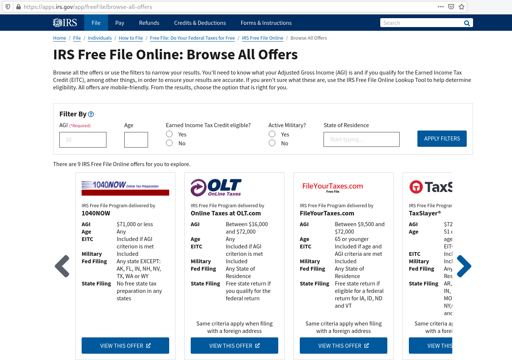
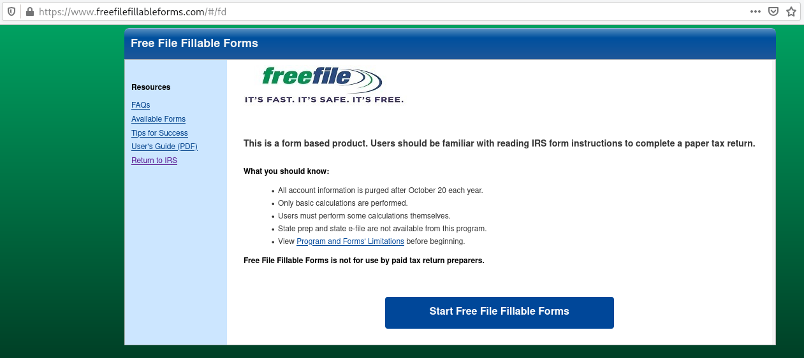
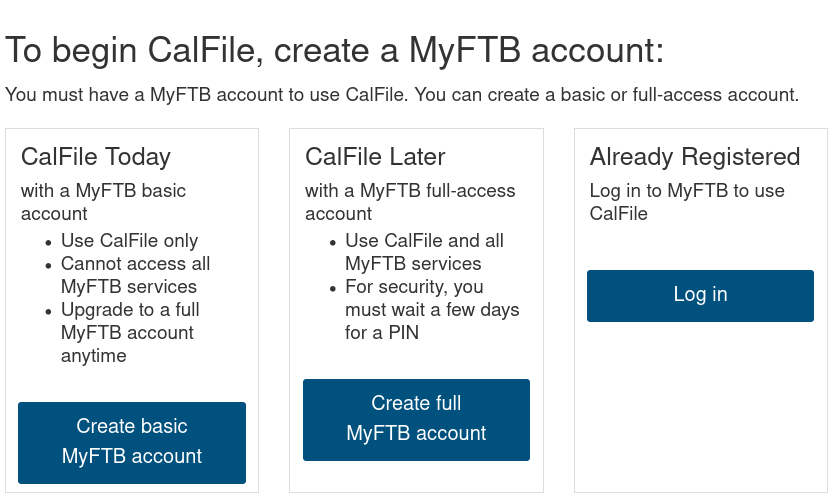

# How to Do Your Taxes for Free

tl;dr: Use [Free File][1].

For some reason, this information is a bit "fringe" and non-mainstream. I think
it speaks volumes about the amount of fuckery that the tax preparation and tax
software industries are doing to the American society. Nevertheless, below is a
guide to actually doing your taxes for *free* ("free" as in "don't pay any
money"). I've seen many friends get conned into paying some stupid, imaginary
fee for using some proprietary tax software, and it doesn't have to be that
way.

Remember:

* Don't use TurboTax, no matter how "free" you may believe it is.
* Don't use TaxAct, no matter how "free" you may believe it is.
* Don't use {insert proprietary tax software here}, no matter how "free" you
  may believe it is, *at least not directly*&mdash;that is, make sure you
  arrive at one of those services [*via Free File*][1] (if you
  qualify&mdash;see below).
* Don't pay for a tax preparer. Doing your taxes is something you should do
  yourself, no matter how complicated you may think it is. While it's true that
  the tax preparation industry has single-handedly lobbied for more and more
  complex tax laws, it's not a reason to give in and use magical wizard-based
  software (that keeps you in the dark about what's actually going on with your
  tax forms) or some overpriced tax professional (unless your tax situation is
  so complicated that you need their assistance, which is arguably *not* the
  case for most people). I am not a financial advisor nor an expert on tax
  laws. This is not financial or tax advice.
* Otherwise, the alternative is to use a proprietary piece of software that
  charges you needless, hidden fees and also harvests more data than it needs
  to (and probably sells that data as well).

## Federal
Start here: [irs.gov/freefile][1]. You're presented with a decision to make:

1. If you made less money than some arbitrary cutoff (canonically $72k at
   the time of this writing, but it differs from tax prep offer to offer)
   in the tax year then you can use an [IRS Free File Offer][4]. This gives you
   a plethora of offers to choose from which are proprietary wizard-based tax
   prep software, likely developed by the same TurboTax people, but is
   actually, truly free of cost). Browsing the offers should look something
   like this:

   

   If you made more money than the arbitrary cutoff, then you'll have to use
   "fillable forms". However, I argue you should use "fillable forms" anyway
   because you should know exactly how to fill those forms out.

1. If you can't (or don't want to) use a Free File offer of a wizard-based tax
   prep software above, then use [freefilefillableforms.com][2]. Go there and
   start the process. You have to make an account, which self-destructs by
   October (so even if you've made an account before, you'll have to make a new
   one). The landing page should look something like this:

   

   This website is the only official, *truly free* way for those who make more
   than the arbitrary cutoff ($72k at the time of this writing) to file their
   taxes in a somewhat modern way (as opposed to filling out the forms in ink
   and mailing them). Essentially, you're just filling out a raw 1040 PDF (and
   any additional forms) but in such a way that you're able to e-file when
   you're done.

   > Note: the same people who make TurboTax, TaxAct, etc. maintain this
   > website, so they probably collect data. If data privacy is your number one
   > concern, it's recommended to fill out your taxes with paper and ink and
   > mail them directly to the IRS.

   It helps if you have your previous tax forms handy (which you probably need
   anyway) to use as a reference when filling out what is essentially the raw
   1040 (and any additional forms you add along the way).

## State
After you've e-filed your federal taxes, use your state's companion to Free
File. For California, that's [CalFile][3], which is part of the Franchise Tax
Board (FTB). Go there and make a "basic" account, which should be enough to get
the job done. Or, if you already have an account (from a previous year) log
into that existing account&mdash;MyFTB accounts are not self-destructing like
Free File Fillable Forms accounts are. The landing page should look something
like this:

Once you're in, it's intuitive to fill out the form (540 in the case of
California) with a "wizard" workflow and it e-file it when you're done.

[1]: https://www.irs.gov/freefile
[2]: https://www.freefilefillableforms.com
[3]: https://www.ftb.ca.gov/file/ways-to-file/online/calfile/index.asp
[4]: https://apps.irs.gov/app/freeFile/
